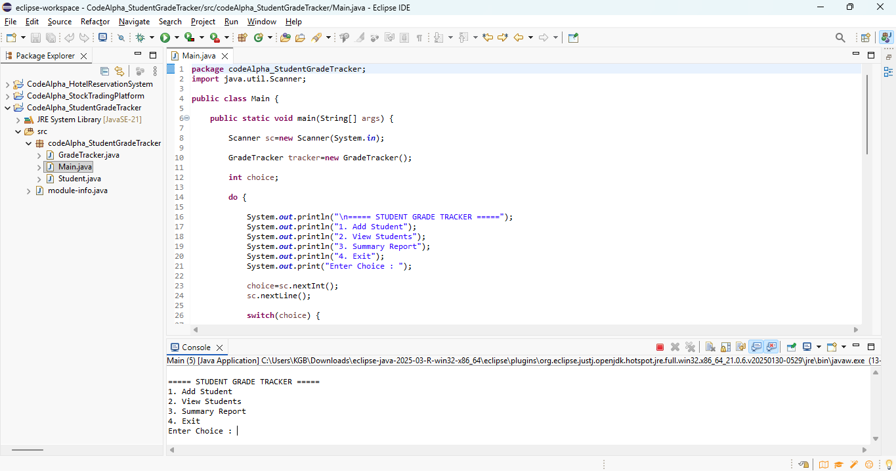
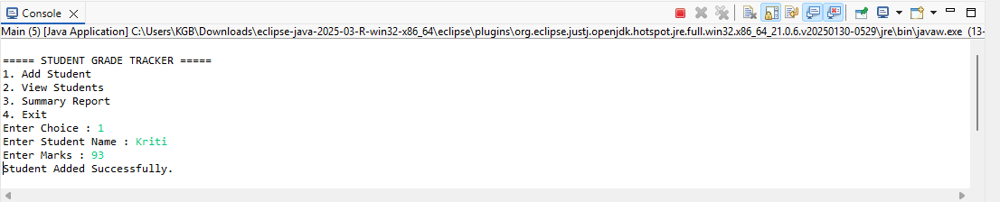

# CodeAlpha - Student Grade Tracker

## Overview
The Student Grade Tracker is a Java console-based application developed as part of the CodeAlpha Java Programming Internship. It allows users to manage student records, calculate grades, and display student performance using object-oriented programming principles.

## Features
- Add student details
- Store student marks
- Calculate grades
- Display all student records
- Console-based user interface

## Technologies Used
- Java
- Eclipse IDE
- Object-Oriented Programming (OOP)
- ArrayList

## Project Structure

```
src/
└── codeAlpha_StudentGradeTracker/
    ├── Main.java
    ├── Student.java
    └── GradeTracker.java
```

## How to Run

1. Clone the repository.
2. Open the project in Eclipse or IntelliJ IDEA.
3. Run `Main.java`.
## 📸 Screenshots

### Main Menu



---

### Add Student



---

### Grade Report


---

## Author

**C V Keerthigha**

CodeAlpha Java Programming Internship
